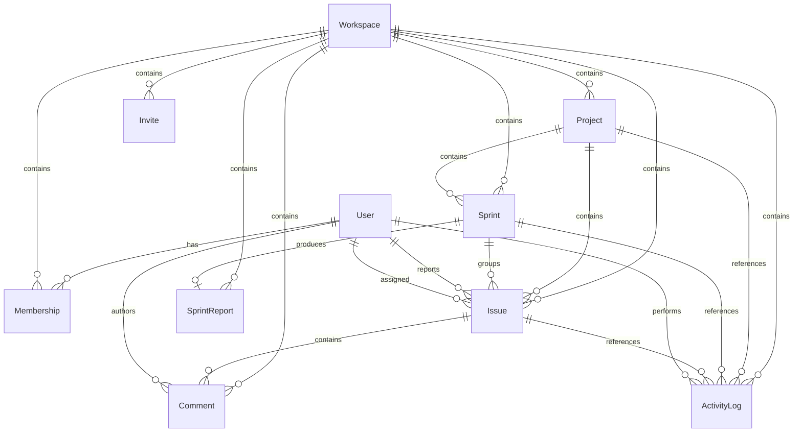

# SunGrid

SunGrid is a multi-tenant project and workspace management application built with Next.js, TypeScript, PostgreSQL, Prisma, and Clerk.

It includes project and issue management, Kanban boards, sprint planning, reporting, analytics, member management, activity history, and isolated guest demo workspaces.

The application is built around workspace-level tenant isolation. Users authenticate globally, but access to data is determined by their membership and role inside each workspace.

## Features

### Workspaces and Access Control

The workspace is the main tenant boundary in SunGrid.

Users can belong to multiple workspaces, with permissions determined independently inside each one.

Supported roles:

* `OWNER`
* `ADMIN`
* `MEMBER`

Clerk handles authentication, while SunGrid handles authorization through workspace membership, role checks, and tenant-scoped database queries.

Protected mutations perform authorization checks on the server rather than relying on UI visibility.

### Projects

Projects belong to a workspace and organize the work tracked by a team.

Users can:

* create projects
* view project details
* archive projects
* restore archived projects
* manage project issues
* use a project Kanban board
* manage project sprints

Projects use archive and restore instead of normal destructive deletion so historical data remains available.

### Issues

Issues are scoped to both a workspace and project.

Each issue can include:

* status
* priority
* type
* story points
* reporter
* assignee
* sprint assignment
* comments
* activity history

Issues can be created, updated, assigned, archived, restored, and moved between statuses.

Issue lookups include tenant context rather than trusting a resource ID by itself.

### Kanban Board

Each project includes a Kanban board for active issues.

Issues can be moved between columns using drag-and-drop, with changes persisted through the application rather than existing only in browser state.

The board loads the active issue working set together so drag-and-drop operations have the state they need.

### Sprints

SunGrid supports sprint planning and lifecycle management.

Users can:

* create sprints
* add issues to sprints
* remove issues from sprints
* start sprints
* complete sprints
* cancel sprints
* review completed sprint reports

Completing a sprint records delivery data such as completion rate and velocity and persists a `SprintReport`.

Completed sprint history remains available for reporting.

### Analytics

Workspace analytics include data around:

* projects
* issues
* sprints
* completion rates
* velocity
* members
* recent workspace activity

### Activity History

Important workspace actions are stored in `ActivityLog`.

Tracked events include:

* project creation
* project archive and restore
* issue creation and updates
* issue archive and restore
* issue movement
* comment creation
* sprint creation
* sprint start, completion, and cancellation
* sprint issue assignment and removal
* member changes
* workspace updates

Activity history is part of the application's persisted data model and is displayed back to users.

### Guest Demo

SunGrid includes a guest demo that can be opened without creating an account.

Each guest session receives its own temporary workspace with seeded:

* projects
* issues
* sprint data
* reports
* activity history

Guest workspaces are isolated from one another and include an expiration time for cleanup.

## Tech Stack

| Area                | Technology                      |
| ------------------- | ------------------------------- |
| Framework           | Next.js App Router              |
| Language            | TypeScript                      |
| UI                  | React, Tailwind CSS             |
| Authentication      | Clerk                           |
| Database            | PostgreSQL                      |
| Production Database | Neon                            |
| ORM                 | Prisma                          |
| Validation          | Zod                             |
| Testing             | Vitest, Playwright              |
| Local Database      | Docker Compose                  |
| CI                  | GitHub Actions                  |
| Security            | CodeQL, Dependabot, npm audit   |
| Observability       | Sentry, structured JSON logging |
| Deployment          | Vercel                          |

## Architecture

SunGrid uses a server-first Next.js App Router architecture.

Most reads and mutations are handled through Server Components, Server Actions, and route handlers.

```text
Browser
   |
   v
Next.js App Router
   |
   +--> Server Components
   |
   +--> Server Actions / Route Handlers
             |
             +--> Zod Validation
             |
             +--> Authentication
             |
             +--> Workspace / RBAC Checks
             |
             +--> Prisma
                    |
                    v
                PostgreSQL
```

Route handlers are used where an HTTP boundary makes sense, including:

* guest demo entry
* Clerk webhooks
* issue movement
* guest cleanup

## Authentication and Authorization

Clerk handles user authentication.

SunGrid handles workspace authorization.

A protected request generally follows this flow:

```text
Resolve Clerk or guest identity
        |
        v
Resolve internal user
        |
        v
Verify workspace membership
        |
        v
Load workspace role
        |
        v
Scope database access
        |
        v
Apply action permissions
```

Roles are stored on workspace memberships rather than as one global application role.

### OWNER

Owners can manage workspace-level administration, member governance, and workspace settings.

### ADMIN

Admins can manage project and delivery workflows without owner-only workspace permissions.

### MEMBER

Members can participate in normal workspace work based on the permissions for each action.

Authorization is enforced on the server. UI visibility is only presentation logic and is not treated as the security boundary.

## Tenant Isolation

Tenant isolation is centered around `workspaceId`.

Protected reads and mutations include workspace context directly in database queries.

Nested resources also include their parent context where needed.

For example, a project or issue ID by itself is not treated as proof that the resource belongs to the current workspace.

This applies across:

* project access
* issue access
* issue movement
* sprint operations
* membership management
* archive and restore flows

## Data Model

The main relational model is centered around `Workspace`.



Membership connects users to workspaces and stores their role inside each workspace.

The database also enforces rules such as one membership per user/workspace pair.

## Data Integrity and Transactions

PostgreSQL constraints and application-level authorization work together to protect application state.

Key project and sprint lifecycle operations use Prisma transactions when multiple writes belong to the same logical action.

Transactional sprint operations include:

* sprint creation
* sprint start
* sprint completion
* sprint cancellation
* adding an issue to a sprint
* removing an issue from a sprint

Transactional project operations include:

* project creation
* project archive
* project restore

For example, sprint completion updates the sprint, writes the sprint report, and records the completion activity inside the same transaction.

```text
prisma.$transaction
        |
        +--> Business Mutation
        |
        +--> ActivityLog Mutation
        |
        v
      Commit
```

If one required write fails, the transaction rolls back instead of leaving application state and activity history out of sync.

## Query and Index Design

Database indexes are based on actual application query patterns.

Representative indexes include:

```text
Membership(workspaceId, createdAt)

Project(workspaceId, createdAt)
Project(workspaceId, archived)

Issue(workspaceId, archived, status)
Issue(workspaceId, projectId, archived, sprintId, createdAt)
Issue(workspaceId, projectId, archived, updatedAt)
Issue(sprintId, archived, createdAt)

Comment(issueId, createdAt)

Sprint(workspaceId, projectId, createdAt)
Sprint(workspaceId, status)

SprintReport(workspaceId, createdAt)

ActivityLog(workspaceId, createdAt)
```

These support common application queries such as:

* workspace project listings
* active and archived project filtering
* issue status queries
* project issue loading
* sprint planning
* issue ordering
* recent activity
* sprint report history

Redundant single-column indexes were removed where an existing composite index already covered the useful prefix.

## Pagination and Working Sets

Pagination is handled based on how each screen actually uses its data.

Current choices include:

* recent activity is bounded
* dashboard and analytics views use recent data
* Kanban loads the active issue working set together
* sprint planning loads its active working set together
* project and sprint lists currently remain unpaginated

The Kanban and sprint-planning views intentionally keep their working sets together because those records are needed at the same time for interaction.

## Testing

SunGrid uses Vitest for application and database testing and Playwright for browser E2E testing.

### Vitest

The current suite contains **38 tests across 6 files**.

| Area                                          |  Tests |
| --------------------------------------------- | -----: |
| Workspace authentication and tenant isolation |      8 |
| Member permissions and RBAC                   |      9 |
| Issue movement                                |      8 |
| Project lifecycle                             |      8 |
| Infrastructure / runtime                      |      2 |
| PostgreSQL integrity                          |      3 |
| **Total**                                     | **38** |

The PostgreSQL integrity tests use a real Prisma client against a Dockerized PostgreSQL test database.

They verify:

* duplicate membership constraints
* tenant-scoped issue queries
* workspace cascade behavior

The rest of the suite covers cases including:

* unauthenticated access
* invalid roles
* cross-workspace IDs
* expired guest sessions
* invalid issue movement
* archived project behavior
* archive and restore lifecycle
* idempotent operations

### Playwright E2E

The Playwright suite contains **3 browser flows**:

1. Guest workspace creation and dashboard access
2. Opening a real project board through the UI
3. Drag-and-drop issue movement with persisted state

The tests cross the actual application stack:

```text
Browser
   |
   v
Next.js
   |
   v
Route / Server Logic
   |
   v
Prisma
   |
   v
PostgreSQL
```

## Continuous Integration

GitHub Actions runs the main repository checks on pushes and pull requests.

The CI flow includes:

```text
npm ci
   |
   +--> Dependency Audit
   |
   +--> Prisma Generation
   |
   +--> Prisma Validation
   |
   +--> PostgreSQL Schema Setup
   |
   +--> Lint
   |
   +--> TypeScript Check
   |
   +--> Vitest
   |
   +--> Production Build
   |
   +--> Playwright E2E
```

CI uses PostgreSQL for tests that require real database behavior.

CodeQL provides static security analysis, while Dependabot monitors dependency and GitHub Actions updates.

## Security

SunGrid includes several security layers:

* Clerk authentication
* server-side RBAC
* workspace-scoped Prisma queries
* Zod validation for mutation input
* signed Clerk webhook verification
* PostgreSQL uniqueness constraints
* foreign-key constraints
* security response headers
* npm dependency auditing
* CodeQL
* Dependabot

Configured response headers include:

```text
X-Content-Type-Options: nosniff
X-Frame-Options: DENY
Referrer-Policy: strict-origin-when-cross-origin
Permissions-Policy
```

The final release verification reported **0 known npm vulnerabilities**.

## Observability

SunGrid uses structured server logging and Sentry.

### Structured Logging

Server-side logs are written as structured JSON.

Operational context can include:

* operation name
* workspace ID
* project ID
* issue ID
* sprint ID
* error information
* Sentry event ID

### Sentry

Sentry is configured for:

* server errors
* client errors
* edge/runtime instrumentation
* Next.js request errors
* performance tracing

Default PII collection is disabled.

## Local Development

### Requirements

* Node.js
* npm
* Docker

Install dependencies:

```bash
npm install
```

Start the local PostgreSQL environment:

```bash
npm run db:up
```

Push the Prisma schema:

```bash
npm run db:dev:push
```

Start the application:

```bash
npm run dev
```

The local development database and automated test database run separately from the production Neon database.

## Testing Locally

Prepare the test database:

```bash
npm run db:up
npm run db:test:push
```

Run the Vitest suite:

```bash
npm test
```

Run the Playwright E2E suite:

```bash
npx playwright test
```

## Deployment

Production is deployed through Vercel with Neon PostgreSQL.

```text
GitHub
   |
   v
GitHub Actions
   |
   v
Vercel
   |
   v
Next.js Application
   |
   v
Neon PostgreSQL
```

Production services are split by responsibility:

* Vercel hosts the Next.js application
* Neon hosts PostgreSQL
* Clerk handles authentication
* Sentry handles error monitoring and tracing
* GitHub Actions runs repository quality checks
* CodeQL performs static security analysis
* Dependabot monitors dependency updates

## Design Decisions

### Archive and Restore

Projects and issues use archive and restore instead of normal destructive deletion.

This keeps historical data available for:

* sprint history
* reports
* comments
* analytics
* activity records

### Synchronous Sprint Reports

Sprint reports are generated when a sprint is completed.

The current workflow performs this work inside the sprint completion transaction rather than using a background queue.

### Board Working Set

The Kanban board keeps the active issue set available together because drag-and-drop operations need the current board state.

### Activity Consistency

For key project and sprint lifecycle actions, the business mutation and activity event are written inside the same transaction so application state and activity history remain consistent.
