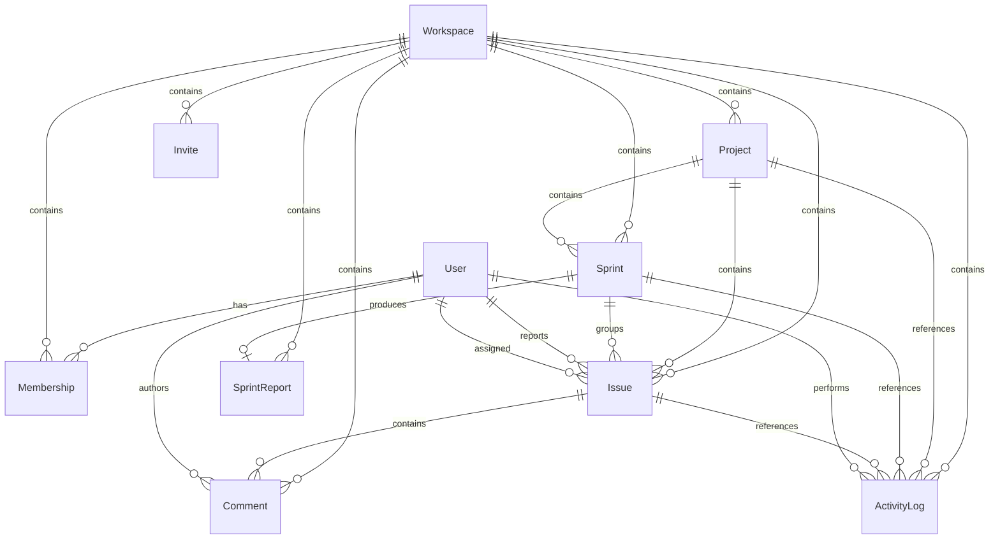

# SunGrid

SunGrid is a multi-tenant project and workspace management application built with Next.js, TypeScript, PostgreSQL, Prisma, and Clerk.

It includes project management, issue tracking, Kanban boards, sprint planning, reporting, analytics, activity history, member management, and a one-click guest demo.

The main focus of the project is workspace isolation and server-side authorization. Users authenticate globally, but access to projects, issues, sprints, reports, members, and activity is scoped to their workspace membership and role.

## Features

### Workspaces and Access Control

- Multi-tenant workspace model
- Clerk authentication
- `OWNER`, `ADMIN`, and `MEMBER` roles
- Server-side workspace checks
- Role-based authorization
- Workspace-scoped database queries
- Tenant-scoped resource lookups
- Isolated guest demo workspaces

Authentication and authorization are handled separately.

Being signed in does not automatically give a user access to workspace data. The application verifies workspace membership and role before protected data is loaded or changed.

Protected mutations also perform their own authorization checks instead of relying on whether a button is visible in the UI.

## Projects and Issues

- Workspace-scoped projects
- Issue status, priority, type, story points, reporter, and assignee
- Kanban board with drag-and-drop issue movement
- Project archive and restore
- Issue archive and restore
- Comments
- Activity history
- Historical data preserved for reporting

## Sprint Management

- Planned, active, and completed sprint lifecycle
- Add and remove issues from sprints
- Sprint completion
- Sprint cancellation
- Completion-rate calculations
- Velocity calculations
- Sprint reports
- Completed sprint history
- Transactional sprint lifecycle updates

## Analytics and Activity

SunGrid includes workspace-level reporting and activity tracking for:

- projects
- issues
- sprints
- members
- activity
- sprint completion
- velocity
- recent workspace events

Important workspace actions are stored as durable activity history.

## Guest Demo

SunGrid includes a one-click guest demo so the app can be explored without creating an account.

Each guest gets their own temporary workspace containing seeded:

- projects
- issues
- sprint data
- reports
- activity history

Guest workspaces also have an expiration time.

Each guest workspace is isolated, so one demo session does not modify another user's data.

## Tech Stack

| Area | Technology |
| --- | --- |
| Framework | Next.js App Router |
| Language | TypeScript |
| UI | React, Tailwind CSS |
| Authentication | Clerk |
| Database | PostgreSQL |
| Production Database | Neon |
| ORM | Prisma |
| Validation | Zod |
| Testing | Vitest, Playwright |
| Local Database | Docker Compose |
| CI/CD | GitHub Actions |
| Security | CodeQL, Dependabot, npm audit |
| Observability | Sentry, structured logging |
| Deployment | Vercel |

## Architecture

SunGrid uses a server-first Next.js architecture.

```text
Browser
   |
   v
Next.js App Router
   |
   +--> Server Components
   |
   +--> Server Actions / Route Handlers
              |
              +--> Zod Validation
              |
              +--> Authentication
              |
              +--> Workspace / RBAC Checks
              |
              +--> Prisma
                     |
                     v
                 PostgreSQL
```

Most data access and mutations happen on the server.

Route handlers are used where an HTTP boundary makes sense, including guest-demo entry, webhooks, and issue movement.

## Tenant Isolation and RBAC

The workspace is the main tenant boundary.

A protected request generally follows this flow:

1. Resolve the current Clerk or guest identity
2. Resolve the internal SunGrid user
3. Verify workspace membership
4. Load the user's workspace role
5. Scope database access to that workspace
6. Apply any role-specific permission checks

SunGrid uses three workspace roles:

| Role | Responsibility |
| --- | --- |
| `OWNER` | Full workspace administration and member management |
| `ADMIN` | Project and delivery management |
| `MEMBER` | Normal workspace participation |

Nested resources are not trusted by ID alone.

For example, project and issue operations include workspace or project context in their database queries so an ID from another tenant cannot be used as a valid access path.

## Data Model



The data model is centered around `Workspace`, which owns the tenant-specific application data.

Memberships connect users to workspaces and store each user's role.

## Data Integrity and Transactions

SunGrid uses PostgreSQL constraints together with application-level authorization.

Important integrity rules include:

- one membership per user/workspace pair
- foreign-key relationships between tenant resources
- explicit cascade or nullification behavior where needed
- archive/restore instead of normal destructive deletion for projects and issues
- completed sprint history preserved for reporting
- transactions for mutations that must update multiple records together

For example, completing a sprint updates the sprint, creates its report, and records the related activity event inside one transaction.

Project creation, archive, and restore also write their activity events transactionally.

If one required write fails, the transaction rolls back instead of leaving the application in a partially updated state.

## Query and Index Design

Indexes were added around actual application query patterns instead of creating single-column indexes for everything.

Examples include indexes for:

- workspace project listings
- active and archived projects
- workspace issue status queries
- project issue loading
- sprint planning
- archived issue history
- recent sprint reports
- recent workspace activity

Representative indexes include:

```text
Membership(workspaceId, createdAt)

Project(workspaceId, createdAt)
Project(workspaceId, archived)

Issue(workspaceId, archived, status)
Issue(workspaceId, projectId, archived, sprintId, createdAt)
Issue(workspaceId, projectId, archived, updatedAt)
Issue(sprintId, archived, createdAt)

Comment(issueId, createdAt)

Sprint(workspaceId, projectId, createdAt)
Sprint(workspaceId, status)

SprintReport(workspaceId, createdAt)

ActivityLog(workspaceId, createdAt)
```

Redundant single-column indexes were removed where existing composite indexes already covered the useful query prefix.

## Pagination and Working Sets

Pagination was added based on how each screen is actually used.

Current choices include:

- activity history limited to the latest 50 events
- small recent-activity queries on the dashboard
- bounded recent analytics data
- active Kanban issues loaded together
- sprint-planning issues loaded together
- project and sprint lists left unpaginated at the current expected workspace size

The Kanban board is intentionally not paginated because drag-and-drop ordering depends on having the active board state available as one working set.

## Testing

SunGrid uses Vitest for application and database testing and Playwright for browser E2E coverage.

### Vitest

The test suite contains **38 tests across 6 files**:

- workspace authentication and tenant isolation — **8 tests**
- member permissions and RBAC — **9 tests**
- issue movement routes — **8 tests**
- project lifecycle rules — **8 tests**
- infrastructure/runtime behavior — **2 tests**
- real PostgreSQL integrity — **3 tests**

The PostgreSQL integrity tests use the real Prisma client against a Dockerized PostgreSQL test database rather than database mocks.

They verify:

- unique user/workspace membership constraints
- tenant-scoped issue queries
- workspace cascade behavior

Other tests cover failure and negative paths including:

- unauthenticated access
- incorrect roles
- cross-workspace identifiers
- expired guest access
- invalid issue movement input
- archived project behavior
- archive/restore authorization
- idempotent lifecycle operations

### Playwright E2E

Playwright covers **3 browser flows** against the real guest-demo application:

- guest dashboard access
- opening a real project board
- drag-and-drop issue movement with persistence through the issue-move API path

These flows cross the browser, Next.js application, route handlers, cookies, Prisma, and PostgreSQL instead of replacing the application with browser-only mocks.

## Continuous Integration

GitHub Actions runs verification on pushes and pull requests.

The pipeline includes:

```text
npm ci
  |
  +--> Dependency Audit
  +--> Prisma Generation
  +--> Prisma Validation
  +--> PostgreSQL Schema Setup
  +--> Lint
  +--> TypeScript Check
  +--> Vitest
  +--> Production Build
  +--> Playwright E2E
```

The CI environment uses PostgreSQL for tests that require real database behavior.

CodeQL provides static security analysis, and Dependabot monitors dependency and GitHub Actions updates.

## Security

Security controls include:

- Clerk authentication
- server-side RBAC
- workspace-scoped Prisma queries
- Zod validation
- signed Clerk webhook verification
- database uniqueness constraints
- foreign-key constraints
- security response headers
- npm dependency auditing
- CodeQL
- Dependabot

Configured response headers include:

```text
X-Content-Type-Options: nosniff
X-Frame-Options: DENY
Referrer-Policy: strict-origin-when-cross-origin
Permissions-Policy
```

The final release verification reported **0 known npm vulnerabilities**.

A broad Content Security Policy is not included because Clerk and other runtime integrations require a CSP that is designed and tested around those dependencies rather than adding a restrictive policy just for appearance.

## Observability

SunGrid uses Sentry and structured server logging for production observability.

Sentry is configured for:

- server errors
- client errors
- edge/runtime instrumentation
- Next.js request errors
- performance tracing

Default PII collection is disabled.

Server-side operational errors include useful context such as workspace, project, issue, or sprint identifiers where relevant without logging credentials or secrets.

## Local Development

Local development and database testing use Docker Compose.

The development and test databases are separate from the production Neon database.

Typical setup:

```bash
npm install
npm run db:up
npm run db:dev:push
npm run dev
```

A separate PostgreSQL database is used for automated database testing.

Local database ports are bound to localhost rather than intentionally exposed to the surrounding network.

## Deployment

Production is deployed through Vercel with Neon PostgreSQL.

```text
GitHub
   |
   v
GitHub Actions
   |
   v
Vercel
   |
   v
Next.js
   |
   v
Neon PostgreSQL
```

Clerk handles production authentication, and Sentry provides error and performance telemetry.

The Clerk proxy configuration is environment-aware so local development and Vercel production can use the correct routing behavior.

## Design Decisions

### Archive Instead of Hard Delete

Projects and issues use archive/restore workflows instead of normal destructive deletion.

Preserving those records keeps historical data available for:

- sprint history
- reports
- comments
- analytics
- activity history

### Synchronous Sprint Reports

Sprint reports are generated as part of sprint completion.

The current workload does not require a background queue, so report generation remains synchronous and transactional.

A queue could be introduced later if the workload grows enough to require asynchronous processing.

### No Pagination Where It Hurts the Workflow

Pagination was not added just because a list exists.

For example, the Kanban board needs the active issue working set together for drag-and-drop behavior, so splitting the board across pages would make the current workflow worse.

## What This Project Demonstrates

SunGrid brings together:

- multi-tenant relational modeling
- workspace isolation
- RBAC
- PostgreSQL constraints
- Prisma transactions
- query and index design
- server-side validation
- archive/restore lifecycle design
- real PostgreSQL integration testing
- browser E2E testing
- Dockerized database infrastructure
- CI/CD
- security scanning
- structured logging
- Sentry observability
- Vercel deployment

The project is focused on the parts that are actually implemented and verified rather than adding extra infrastructure just to make the stack look larger.
