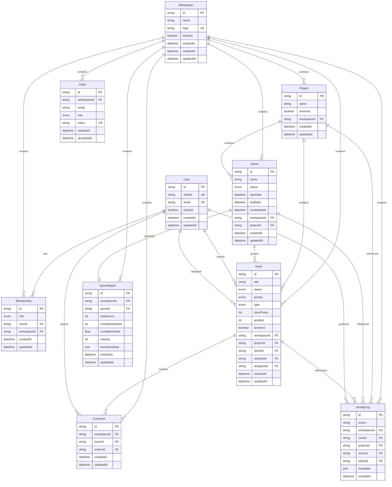

# SunGrid

SunGrid is a multi-tenant project and workspace management application built with Next.js, TypeScript, PostgreSQL, Prisma, and Clerk.

It is designed around a strict workspace boundary: users authenticate globally, but access to projects, issues, sprints, reports, members, and activity is determined by workspace membership and role-based authorization.

The project focuses on backend correctness, tenant isolation, failure handling, testing, observability, and production deployment rather than adding unnecessary SaaS features.

## Core Capabilities

### Workspaces and Access Control

- Multi-tenant workspace model
- Clerk authentication
- Workspace membership records separate authentication from authorization
- `OWNER`, `ADMIN`, and `MEMBER` roles
- Server-side workspace and role checks
- Workspace-scoped database access
- Guest demo workspaces isolated from signed-in user workspaces

### Projects and Issues

- Workspace-scoped projects
- Issue status, priority, type, story points, reporter, and assignee
- Kanban board workflow
- Project and issue archive/restore flows
- Archived data remains available for historical reporting and activity records

### Sprint Management

- Planned, active, and completed sprint lifecycle
- Issue assignment and removal
- Sprint completion reports
- Completion rate and velocity calculation
- Completed sprint history preserved
- Sprint mutations and their audit events use database transactions where consistency requires both writes to succeed together

### Activity and Analytics

- Durable workspace activity history
- Project, issue, sprint, and workspace events
- Workspace-level analytics
- Recent activity views
- Sprint report summaries and velocity data

### Guest Demo

- One-click guest product evaluation
- Isolated temporary guest workspaces
- Seeded projects and issues
- Expiring guest data
- No account creation required for the demo flow

---

## Tech Stack

| Layer | Technology |
| --- | --- |
| Framework | Next.js App Router |
| Language | TypeScript |
| UI | React + Tailwind CSS |
| Authentication | Clerk |
| Database | PostgreSQL |
| Production Database | Neon |
| ORM | Prisma |
| Validation | Zod |
| Unit / Integration Testing | Vitest |
| End-to-End Testing | Playwright |
| Error Monitoring | Sentry |
| Deployment | Vercel |
| CI | GitHub Actions |
| Security Analysis | CodeQL + Dependabot |
| Local Database Infrastructure | Docker Compose |

---

## Architecture

SunGrid uses a server-first Next.js architecture.

```text
Browser
  |
  v
Next.js App Router
  |
  +--> Server Components
  |
  +--> Server Actions / Route Handlers
          |
          +--> Zod input validation
          |
          +--> Clerk authentication
          |
          +--> Workspace membership / RBAC checks
          |
          +--> Prisma
                  |
                  v
              PostgreSQL
```

Cross-cutting production concerns are handled separately:

```text
Application
  |
  +--> Structured server logging
  |
  +--> Sentry error monitoring
  |
  +--> Sentry performance tracing
  |
  +--> Security headers
  |
  +--> GitHub Actions CI
  |
  +--> CodeQL
  |
  +--> Dependabot
  |
  +--> Vercel deployment
```

### Tenant Boundary

Authentication alone does not grant access to workspace data.

A user must have a `Membership` connecting them to a workspace:

```text
User
  |
  v
Membership
  |
  v
Workspace
  |
  +--> Projects
  +--> Issues
  +--> Sprints
  +--> Sprint Reports
  +--> Comments
  +--> Invites
  +--> Activity Logs
```

Protected application flows verify workspace membership before accessing tenant resources.

Nested resources are additionally scoped using identifiers such as `workspaceId`, `projectId`, and resource IDs rather than trusting a resource ID by itself.

This is the primary security boundary of the application.

---

## Role Model

SunGrid currently has three workspace roles:

| Role | Responsibility |
| --- | --- |
| `OWNER` | Full workspace administration |
| `ADMIN` | Project and delivery management |
| `MEMBER` | Normal workspace participation |

Authorization logic is centralized through workspace access helpers and enforced server-side.

UI visibility is not treated as a security boundary. Protected mutations perform their own authorization checks.

---

## Data Model



---

## Database Integrity

SunGrid uses relational constraints and application-level authorization together.

Important integrity rules include:

- A user can have only one membership per workspace.
- Foreign-key relationships preserve model relationships.
- Deleting parent records uses explicit cascade or nullification behavior depending on historical requirements.
- Completed sprint reports remain associated with their sprint history.
- Archived projects and issues are retained instead of treating normal archive actions as destructive deletes.
- Important business mutations and their activity records are grouped in Prisma transactions where partial success would create misleading state.

For example, sprint completion updates the sprint, persists its report, and writes its activity event as one database transaction.

Project creation, archive, and restore operations also persist their corresponding audit event transactionally.

---

## Query and Index Design

The Prisma schema contains composite PostgreSQL indexes based on observed application access patterns rather than adding indexes to every field independently.

Examples include:

```text
Membership(workspaceId, createdAt)

Project(workspaceId, createdAt)
Project(workspaceId, archived)

Issue(workspaceId, archived, status)
Issue(workspaceId, projectId, archived, sprintId, createdAt)
Issue(workspaceId, projectId, archived, updatedAt)
Issue(sprintId, archived, createdAt)

Comment(issueId, createdAt)

Sprint(workspaceId, projectId, createdAt)
Sprint(workspaceId, status)

SprintReport(workspaceId, createdAt)

ActivityLog(workspaceId, createdAt)
```

These correspond to real application query shapes such as:

- workspace project listings ordered by creation time
- active project counts
- workspace issue status aggregation
- project issue loading
- sprint issue planning
- archived project issues ordered by most recent update
- recent activity feeds
- recent sprint reports

Single-column indexes that were redundant with useful composite prefixes were removed where appropriate.

---

## Pagination and Scale Decisions

Pagination was evaluated against the actual read paths instead of added as a checkbox feature.

Current behavior is intentional:

- The activity page is bounded to the latest 50 entries.
- Dashboard activity loads only a small recent set.
- Analytics loads small recent activity and sprint-report sets.
- The Kanban board loads the active project working set because drag-and-drop ordering depends on having the board state together.
- Sprint planning loads the relevant project sprint working set because assignment operations depend on that collection.
- Project and sprint lists remain unpaginated at the expected tenant size of the current application.

If tenant datasets become materially larger, project and sprint list pagination can be introduced without changing the tenant model.

No performance benchmark or `EXPLAIN ANALYZE` result is claimed unless explicitly measured.

---

## Transaction Strategy

Activity history is treated as part of important business state, not decorative logging.

For mutations where an activity event describes a database change, SunGrid can pass the Prisma transaction client into the activity logger:

```text
prisma.$transaction
  |
  +--> business mutation
  |
  +--> ActivityLog mutation
  |
  v
commit together
```

If either write fails, the transaction rolls back.

This prevents cases such as:

- reporting that a sprint completed when its activity entry failed
- recording a cancellation when the sprint deletion failed
- creating a project while returning a database failure because its audit write failed separately

---

## Testing Strategy

SunGrid uses multiple testing layers.

### Unit and Integration Tests

Vitest covers areas including:

- workspace authentication behavior
- RBAC permissions
- tenant isolation
- project lifecycle rules
- database integrity
- issue movement behavior
- failure paths

The current suite contains 38 tests across six test files.

### End-to-End Tests

Playwright exercises the real guest-demo application flow, including:

- guest dashboard access
- opening an actual project board
- drag-and-drop issue movement
- mutation persistence through the issue-move API path

### CI

GitHub Actions runs automated checks against PostgreSQL using a CI database service.

The pipeline includes:

```text
npm ci
  |
  +--> dependency audit
  +--> Prisma generation
  +--> Prisma validation
  +--> database schema sync
  +--> lint
  +--> TypeScript check
  +--> tests
  +--> production build
  +--> Playwright E2E
```

CodeQL provides static security analysis, and Dependabot tracks dependency and GitHub Actions updates.

---

## Security

Security controls include:

- server-side authentication
- workspace-scoped authorization
- role-based mutation permissions
- Zod validation on user-controlled mutation boundaries
- signed Clerk webhook verification
- tenant-scoped Prisma queries
- database uniqueness and foreign-key constraints
- dependency auditing in CI
- CodeQL scanning
- security response headers

Configured response headers include:

```text
X-Content-Type-Options: nosniff
X-Frame-Options: DENY
Referrer-Policy: strict-origin-when-cross-origin
Permissions-Policy
```

A broad Content Security Policy is not currently added because Clerk and other runtime integrations require an intentionally designed policy rather than a restrictive configuration added without validation.

---

## Observability

Production observability uses Sentry and structured server logs.

### Sentry

Configured capabilities include:

- server error monitoring
- client error monitoring
- edge/runtime instrumentation
- Next.js request error instrumentation
- performance tracing
- environment-aware configuration

Default personally identifiable information collection is disabled.

### Structured Logging

Server-side application logs use a shared JSON logger instead of scattered raw `console` calls.

Operational errors include structured context such as:

```text
operation
workspaceId
projectId
issueId
sprintId
```

where relevant.

This improves production debugging without putting secrets into application logs.

---

## Local PostgreSQL with Docker

SunGrid uses Docker Compose for reproducible local PostgreSQL environments.

The development database is bound to localhost rather than exposed on all network interfaces.

Typical local workflow:

```bash
npm run db:up
npm run db:dev:push
npm run dev
```

Database status and shutdown helpers are also available through the project scripts.

A separate test PostgreSQL database is used for automated database tests.

Production remains separate from these local Docker databases.

---

## Deployment

The production application is deployed with:

```text
GitHub
  |
  +--> GitHub Actions validation
  |
  v
Vercel
  |
  v
Next.js application
  |
  v
Neon PostgreSQL
```

Clerk provides production identity management.

Sentry receives production error and performance telemetry when its environment configuration is present.

Local Docker database operations do not modify the production Neon database.

---

## Intentional Product Decisions

### Archive Instead of Normal Hard Delete

Projects and issues use archive/restore workflows because deleting historical records would reduce the correctness of:

- sprint history
- reports
- comments
- analytics
- activity history

### Synchronous Sprint Report Generation

Sprint reports are currently generated during sprint completion.

A background queue is not required by the present workload, so one is not included solely for architectural appearance.

---

## Repository Engineering

SunGrid demonstrates:

- multi-tenant relational modeling
- RBAC authorization
- tenant isolation
- PostgreSQL index design
- transaction handling
- data-integrity constraints
- server-side validation
- integration testing
- browser E2E testing
- Dockerized database infrastructure
- CI/CD
- security scanning
- structured production logging
- error monitoring
- performance tracing
- production deployment

The goal of the repository is to make those engineering decisions inspectable in code rather than relying on portfolio claims that cannot be verified.

